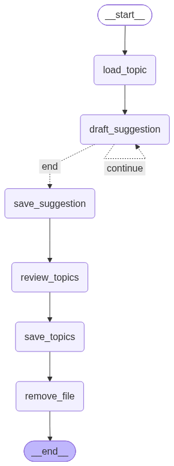

# Small Language Model (SLM) Agentic Reviewer

An automated, local agentic pipeline designed to review, structure and update Quarto-based personal documentation. 

## Infrastructure
* **Compute:** Locally hosted on an Oracle server using 4 ARM CPUs and 24GB RAM.
* **Models:** Based on the Gemma 4 family (`gemma4:e2b`, `gemma4:e4b`, `gemma4:12b`) via Ollama.
* **Framework** Built on the LangGraph framework for agents.

## Workflows

### Topic Suggestion
This workflow is currently deployed to manage and expand the theoretical foundation sections of my personal [mzaiam Website](https://github.com/mZaiam/notes) notes repository.

## Project Structure
* `main.py`: Script that runs the workflows.
* `workflows/`: Contains the LangGraph workflows.
* `nodes/`: Modular functions for the workflows.
* `state.py`: Defines the state class.
* `prompts.py`: Contains the prompts used for the workflows.